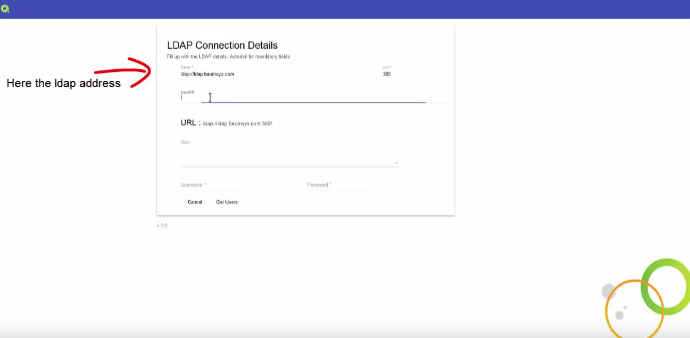

# NPrinting Ldap user importer
NPrinting Ldap user importer is a web tool to import users from a generic LDAP source to NPrinting Server. It works also with Windows Active Directory (AD). You can install it everywhere (eg. on NPrinting server or on your local machine) and use it from a modern browser. It has been built using the Angular 4 Framework.

# Installation
Just download the latest release and unzip the source file in the desired folder. Open a window's console in the destination folder and type "npm start". The window's console need to remain opened while the process is running. Closing the that window's console cause the process exit.

# System Requirements
Node.js and npm need to be installed as system requirements. Please vitits (https://nodejs.org/en/download/) for more information.
NPrinting June release 2017 version or later is required.

# How to use it
From your browser point to http://[Server_Name]:3000. Where <Server> is the server name or ip address where you installed the LDAP importer.

Here a 2min demo video 

